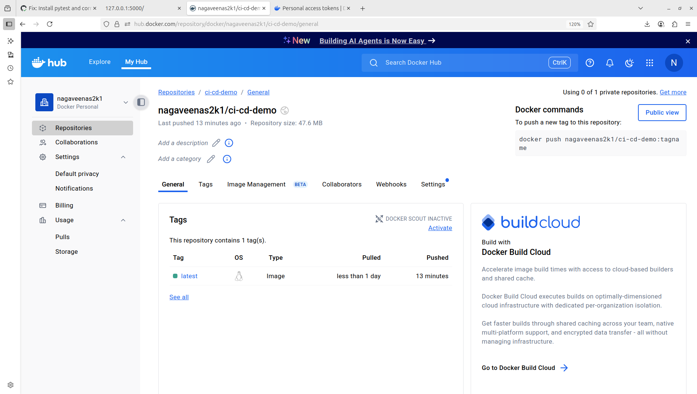

# CI/CD Pipeline with GitHub Actions & Docker

## Overview

This project demonstrates a complete CI/CD pipeline using **GitHub Actions** and **Docker** for a Python Flask application. The pipeline builds, tests, and pushes your Docker image automatically to Docker Hub on every push to the `main` branch, and supports local deployment for development or demonstration.

---

## Directory Structure

```plaintext
ci-cd-docker-github/
├── app/
│ ├── app.py
│ ├── requirements.txt
│ └── tests/
│ └── test_app.py
├── Dockerfile
├── docker-compose.yml
├── .github/
│ └── workflows/
│ └── ci-cd.yml
├── README.md
├── screenshots/
│ ├── github-actions-success.png
│ ├── dockerhub-image.png
│ ├── local-app-running.png
│ └── terminal-screenshot.png
```

---

## Features

- Automated testing with **pytest**
- Automated Docker image build and push with **GitHub Actions**
- Secure DockerHub credentials via **GitHub Secrets**
- Easy local deployment with **Docker Compose**
- Deployment screenshots and validation

---

## CI/CD Workflow

The workflow is triggered **automatically** on a push to the `main` branch and follows these steps:

1. Check out the code from the repository
2. Set up Python environment
3. Install dependencies and `pytest`
4. Run unit tests
5. Build Docker image: `nagaveenas2k1/ci-cd-demo:latest`
6. Log in to Docker Hub
7. Push Docker image to Docker Hub

You can find the workflow definition at `.github/workflows/ci-cd.yml`.

---

## How to Run Locally

### Clone and Start the App

- Clone : [https://github.com/Nagaveenas2k1/DevOps-internship-project.git](https://github.com/Nagaveenas2k1/DevOps-internship-project.git)

  - ``cd DevOps-internship-project/ci-cd-docker-github``
  
  - ``docker-compose up``

- Access the app at [http://localhost:5000](http://localhost:5000).

### Pull Prebuilt Image from Docker Hub

`docker pull nagaveenas2k1/ci-cd-demo:latest`

`docker run -p 5000:5000 nagaveenas2k1/ci-cd-demo:latest`

---

## DockerHub Image

- [DockerHub Repository Link](https://hub.docker.com/repository/docker/nagaveenas2k1/ci-cd-demo)

---

## Screenshots

### GitHub Actions CI/CD Workflow Success:
    
  

---

### Docker Hub Image Page:
   
  

---

### Application Running Locally:
  
  

---

### Terminal Output (Build/Run/Deploy):
  
  

---

## How to Configure GitHub Secrets

1. Go to your repository **Settings** > **Secrets and variables** > **Actions**
2. Add secrets:
   - `DOCKERHUB_USERNAME` — your Docker Hub username
   - `DOCKERHUB_TOKEN` — Docker Hub access token

Your workflow will securely use these to log in and push the Docker image.

---

## Author
- S Nagaveena


